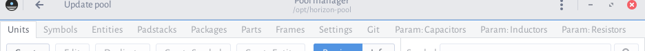

# Horizon's Pool and What Makes It Special

Navigating the pool can be intimidating at first. What are all those tabs?

This chapter focuses one the core ideas behind the pool. As you're here because you want to add new parts to the pool, at least some knowledge of its structure is required to make this comfortable. After reading this guide, you should be confident in navigating around the pool, knowing what to find where.

## Core ideas

You've perhaps used some other electronics EDA software before having a look at Horizon, so it makes sense to say a few words about the key points Horizon's pool is designed around, in contrast to other EDA system's part libraries. Some might seem odd at first, so I'll add a little bit of motivation for these design choices.

This section is mainly a rewording of the [Horizon documentation's *why* chapter](https://horizon-eda.readthedocs.io/en/latest/pool-why.html), which you should check out if you want a more compact description.

### There is no hierarchy

Immediately apparent when opening the pool manager is that all you see is a big list. There is no tree structure, no ‘folders’, or anything hierarchical.

This also means there is just one pool for each project. You can't include several pools, e.g. a *resistors*, a *capacitors* pool, and so on, in a project and use them like libraries. Pools can still *include* other pools, but the resulting structure still has a flat hierarchy.

If you've created parts in EAGLE, you almost certainly copied a schematic symbol across from a different library because you needed it somewhere else, too. Something like this won't be necessary in Horizon, where every part can reference every symbol/package/etc.

### File names don't really matter

If you've looked at the pool's structure on disk, you might exclaim: ‘But there is hierarchy! I see folders called *diode* and *relay* right here!’. While this is true, the directory structure is just a measure to keep the files manageable when changing something.

All items in the pool have a *universally unique identifier* (UUID). This isn't really relevant for the average user, but it makes it possible to rename or move files however you want to without changing anything for the pool itself (or for any project using the pool). The only exception are 3D models: Because they are stored as STEP and not as JSON like everything else, the don't have a UUID and are referenced by their file name.

While UUIDs are used to reference specific items of the pool in each other and everywhere else, Horizon still needs to access the JSON, e.g. for drawing the actual schematic symbol. This is why each pool contains a file `pool.db` where all those UUIDs are listed together with the paths of the files they are defined in. This file is refreshed when clicking the big ‘Update pool’ button right at the top of the pool manager. This is why you have to hit that button when changing the pool externally (e.g. when updating its git repository from upstream).

### Parts are… actual parts

If you are used to KiCad, you will probably notice the missing separation between symbols and footprints. In Horizon, a *part* always contains both without the option to separate them during schematic capture or board layout. While this loses you some flexibility, it guarantees that the pinouts are correct and you're not using a symbol together with an incompatible footprint.

Moreover, the parts all have a *manufacturer part number* (MPN). They actually exist, you can order them and you can be sure that you will have the same part on your schematic and in your hands.

There has been some discussion about *generic parts* (for example a generic 0603 10 kΩ resistor and not a particular model from a particular manufacturer) but at the time of this writing this feature isn't ready yet.

## Pool structure

So much about the general ideas, but how about the actual structure? Horizon has a a bit more fine-grained subdivision baked into its Pool system and it makes sense to leave a few words on all the elements and what they do.

Let's finally look at the tabs of the pool manager. We'll start from the right but skip the ‘Param’ and ‘Git’ tabs for now because the remaining tabs closely mirror the actual structure of the pool.

### Frames

A *frame* is nothing more than an outline for your schematic. It can contain some extra drawings and text, it might reference *variables* of your design (such as the project name or the schematic number) but after all its nothing more than a rectangle around the perimeter of a schematic you'd otherwise be drawing by hand.

### Parts

As mentioned before, the main identifier here is the MPN, but the pool browser also lets you search for parts by manufacturer, bits of description or tags.

When selecting a part from the list, the right half of the window shows a preview how it'll look in the schematic or on the board but also a few more bits of information at the top, like a data sheet link.

The preview also lets you select different *gates*, *symbols* and *packages* for the part (if there is more than one). More on that later.

### Packages

What you saw on the rightmost preview panel was a *package*, i.e. a footprint, or, what actually ends up in the board layout.

The package browser also has a manufacturer search field because footprints are often specific to some manufacturer (think of a connector nobody else produces).

Packages can have alternatives. For example, you can find multiple variants of a DIP8 which differ in their silkscreen or the space they need on the PCB. These alternatives are what's shown in the drop-down above the package preview in the parts browser: Because they are meant for the same part, they can be exchanged on the board, e.g. when a different assembly process is considered.

### Padstacks

A package is not just composed of line drawings or text. The most important parts of it are the solder pads. Horizon doesn't have any hard-coded knowledge about how round through-hole or rectangular SMD pads look like. Instead, the pool's *padstacks* supply this information.

You will only very rarely have to create your own padstacks because the most common pad shapes are already there and can be parametrised: For example, you can supply width and height for a rectangular SMD pad as you can adjust all dimensions of a through-hole slit pad.

You might also notice that some padstacks have text in the ‘Package’ column and others do not. Sometimes, a package contains very odd pad shapes and you'll have to create a padstack for that. Because this very special padstack won't be needed in any other package, it is stored under that package (and will not be available to other packages).

### Entities

At this point, we have everything for the footprints and we can move to the items holding all schematic information. Generally speaking, an *entity* holds a more abstract representation of a part, or, what you'd see in a schematic. As such, entities are not always bound to a specific MPN: You'll also find more general entities like a ‘Battery holder’ in the entity list.

If you think back to our look at the *part* browser you might recognise the entity list's preview as the left half of the part tab's. This analogy holds up: a part contains the connection between an entity and a package (plus some metadata). The entity contains no information about pin numbers or how a footprint's pads are used; that is the part's job.

When you, for example, select the ‘Quad AND gate’ entity, you'll notice that you can select 5 different *gates* just above the symbol preview. The entity contains 4 logic gates and a gate with the power supply pins, which you can all place independently on a schematic.

If you've used Horizon's schematic capture, you might have come across the ‘place component’ tool. This lets you place an *entity* in your schematic instead of a *part* so you can choose the footprint (and thus the part) later.

### Symbols

This probably doesn't come as a surprise, but a *symbol* is the graphical representation of a gate you'd see on a schematic. Just like entities, symbols can be either pretty generic (‘Crystal‘) or specific to some MPN.

### Units

Finally, the leftmost tab holds the *units*. These hold the ground truth symbols are based on: Pins with names. In other words, a symbol is nothing more than a graphical representation of a unit.

So why are they not merged into one thing, then? Because you can have multiple symbols for the same units, e.g. a EU and a US style resistor or connectors with all pins in one row and some other arrangement. These are all equivalent representations of the same gate, so they are considered *alternatives* by Horizon and you can select any symbol based on the unit referenced in the entity when placing it on a schematic.

### And the remaining bits

This covers the main elements of the Pool, but we're still left with 4 tabs.

The ‘Git’ tab holds a basic version control integration. Horizon's pool is backed by a *git* repository and within this tab you can commit your changes without having to pop up a terminal or another git client.

Last but not least, the ‘Param:’ tabs hold data tables for the most common passive components which make schematic entry a bit easier. Adding parametric data to parts is not that relevant for most cases, so we'll leave this for the more advanced chapters.

## Conclusion

Hopefully you've gained some understanding about the integral elements of Horizon's pool. The main takeaway is that there's not just schematic symbols, PCB footprints and connections between pins and pads; there are a bunch of different elements referring to each other.

Of course this means there's more work to do when adding a new part. But it also means the resulting parts library can be quite flexible while still giving strong guarantees.

The next chapter will deal with the pool as a whole. We'll look into included pools and their usefulness for keeping parts separated, but also into the basic workflow for contributing new parts to *upstream*.